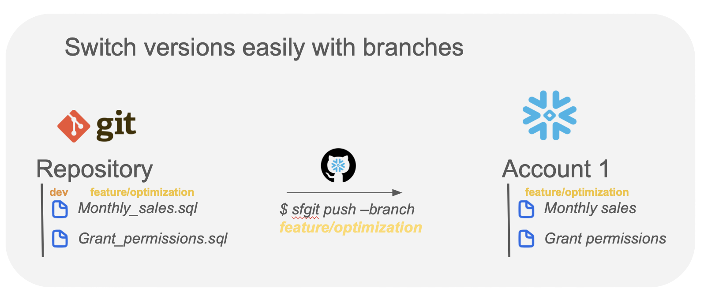
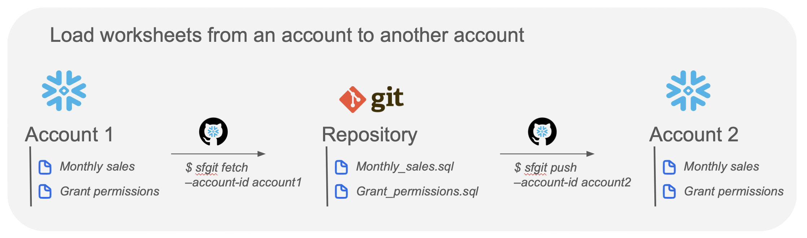

<p align="center">
  
</p>


[](mailto:thomas.dambrin@gmail.com?subject=[GitHub]%20Snowflake%20Git%20Versioning)
[](https://opensource.org/licenses/MIT)


# Snowflake Git

🆕 Git now supported in Snowflake, see the [official documentation](https://docs.snowflake.com/en/developer-guide/git/git-overview).

# Worksheet Versioning

Inspired by a snowflake developers maintained [repository](https://github.com/Snowflake-Labs/sfsnowsightextensions).

### Git integration 

The extension is designed to **apply git versioning on worksheets while developing on Snowsight, fully taking advantage of its functionalities**.\
The following workflow is advised :
1. [Start session] Upload worksheet from local branch to a user Snowsight workspace
2. Test, update and validate on Snowsight 
3. [End session] Update local branch with modified Snowsight worksheets

## Install

Entry points are accessible through a CLI once the package is installed. 
To install it, please follow the following steps :

```bash
# [Optional: Python virtual environement]
$ pyenv virtualenv 3.10.4 sf
$ pyenv activate sf

# [Mandatory: Pip install]
$ pip install -U pip
$ pip install sf_git==1.4.1

# [Check your installation]
$ sfgit --version
# [Should result in:]
# sfgit, version 1.4.1


# [Check your installation]
$ sfgit --help

# [Should result in:]
# Usage: sfgit [OPTIONS] COMMAND [ARGS]...
# 
# Options:
#   --help  Show this message and exit.
# 
# Commands:
#   commit  Commit Snowsight worksheets to Git repository.
#   config  Configure sfgit for easier version control.
#   fetch   Fetch worksheets from user Snowsight account and store them in...
#   init    Initialize a git repository and set it as the sfgit versioning...
#   push    Upload locally stored worksheets to Snowsight user workspace.
```

Commands have been created to **import/export (respectively fetch/push) snowsight worksheets to/from local**.

## Configure your git

> **Warning**
> A git repository is necessary to manage worksheets. You can either use an existing one
> or create a new one.

To apply versioning to your worksheets, you need to **configure Git information**
through the config command. 

First, set git repository to be used:

```bash
# if you want to use an existing git repository
$ sfgit config --git-repo <path_to_git_repo>

# if you want to create a new one 
$ sfgit init -p <path_to_git_repo>
```

Then, set a location to save your worksheets within this git repository:
```bash
$ sfgit config --save-dir <path_to_worksheets_persistency_directory>
```

## Authenticate
Currently, only authentication mode supported is the credentials (PWD) mode.

> :warning: The single sign-on (SSO) will be fixed.

Commands requiring Snowsight authentication all have options to provide at command time. 
If you don't want to manually input them everytime, you can set them at Python/Virtual environement level with :


```bash
$ sfgit config --account <your_snowsight_account_id>
$ sfgit config --username <your_snowsight_login_name>
$ sfgit config --password <your_snowsight_password>  # unnecessary for SSO authentication mode
```

### Account ID

> [!WARNING]  
> `The account ID to be configured is in the <account_name>.<region>.<cloud> format.`

If you are unsure about how to retrieve it for your snowflake account, you can run this query:

```sql
SHOW REGIONS;

WITH 
    SF_REGIONS AS (SELECT * FROM TABLE(RESULT_SCAN(LAST_QUERY_ID()))),
    INFOS AS (SELECT CURRENT_REGION() AS CR, CURRENT_ACCOUNT() AS CA)
SELECT CONCAT(
        LOWER(INFOS.CA),
        '.',
        SF_REGIONS."region",
        '.',
        SF_REGIONS."cloud"
    ) AS account_id
FROM INFOS LEFT JOIN SF_REGIONS ON INFOS.CR = SF_REGIONS."snowflake_region";

```

Unfortunately, the _region_ is not always the same in the _SHOW REGIONS_ ouput. Please check and adapt the format comforming to the official [documentation](https://docs.snowflake.com/en/user-guide/admin-account-identifier#non-vps-account-locator-formats-by-cloud-platform-and-region).
For example, eastus2 for Azure should actually be east-us-2.


## Use

**Import user worksheet locally** :
```bash
$ sfgit fetch --auth-mode PWD
```

**Import user worksheet locally (using command time args)** :
```bash
$ sfgit fetch --username tdambrin --account-id my_account.west-europe.azure -p mysecret -am PWD
```

**See what changed for only your worksheets in the git** :
```bash
$ sfgit diff
```

**Commit you worksheets** (or through git commands for more flexibility) :
```bash
$ sfgit commit --branch master -m "Initial worksheet commit"
```

**Export user worksheets to Snowsight** 
```bash
$ sfgit push --auth-mode PWD --branch master
```

## Be creative

Use the package to fit your use case, versioning is a way to do many things.

### Switch versions

<div align="center">
    
</div>


### Transfer worksheets to another account



## Policies
Feedbacks and contributions are greatly appreciated. This package was made to ease every day life for Snowflake 
developers and promote version control as much as possible.

For questions, please feel free to reach out [by email](mailto:thomas.dambrin@gmail.com?subject=[GitHub]%20Snowflake%20Git%20Versioning).
